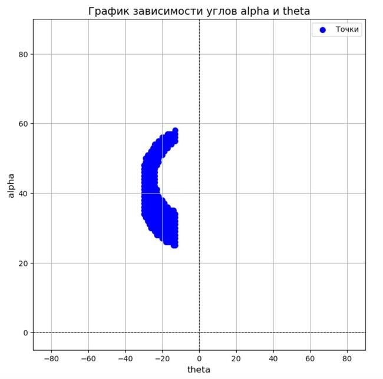
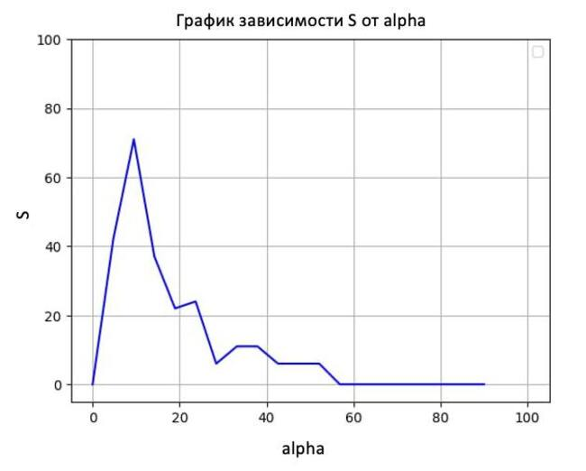
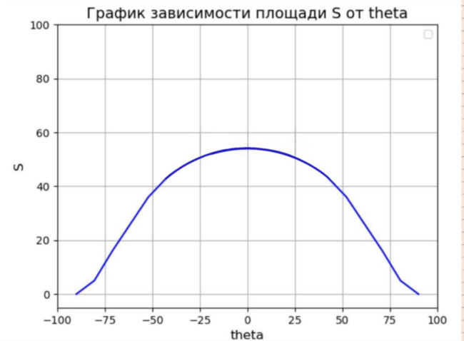
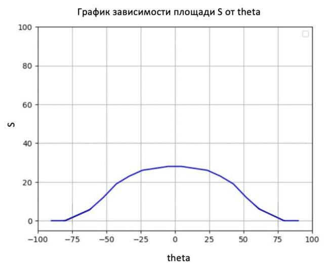
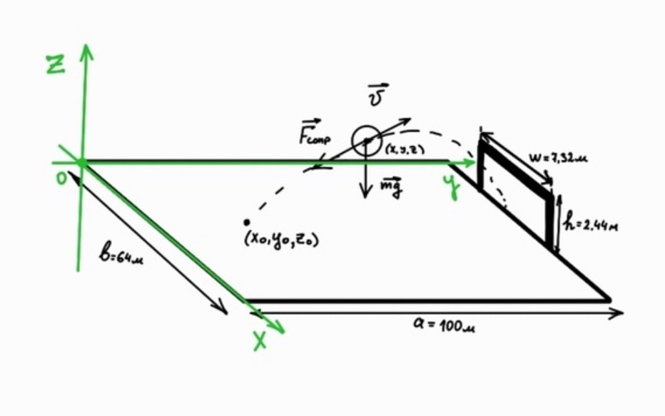

# Курсовая работа по Математическому моделированию
**Выполнила**: Комольцева Диана ВИтальевна ПМ-42
## Содержательная постановка задачи
### Задача о футболисте (с учетом радиуса мяча и учетом трения о воздух)
Постановка задачи:
1. Определить зависимость угла удара по вертикали от угла к створу ворот для голевой ситуации
2. Определить область на поле, откуда спортсмен попадает в створ ворот
3. Определить зависимость площади попадания от углов удара
4. Определить зависимость площади попадания от скорости и углов удара 

## Концептуальная постановка задачи
Необходимо составить математическую модель полета футбольного мяча с заданным радиусом и массой в условиях действия поля силы тяжести с учетом сопротивления воздуха. Необходимо исследовать, при каких параметрах (углах начальной скорости к горизонту и к вертикали, начальных координатах, величине начальной скорости) удар по мячу будет соответствовать удару при голевой ситуации.


### Основные параметры:
- $v_0$ — начальная скорость мяча
- $x_0, y_0, z_0$ — начальное положение мяча
- $\theta$ —  угол удара по горизонтали
- $\alpha$ — угол удара по вертикали
- $C_d$ — коэффициент сопротивления воздуха
- $\rho$ — плотность воздуха
- $A$ — площадь поперечного сечения мяча
- $m$ — масса мяча
- $r$ — радиус мяча
- $g$ — ускорение свободного падения
- Высота ворот $h = 2.44$ м
- Ширина ворот $w = 7,32м$
- Размеры поля $a = 100м, b = 64 м$

### Примем следующие допущения:
1. Рассмотрим мяч как материальную точку с массой m, радиусом r
2. Движение происходит в поле силы тяжести с постоянным ускорением свободного падения g=9,81 и описывается уравнениями классической механики Ньютона
3. На мяч действует сила сопростивления воздуха, вычисляемая по формуле:
$\vec{F_{сопр}} = -\frac{1}{2}C_dApV\vec{V}$
4. Мяч движется в воздушной среде с плотностью p = 1,2255 кг/м³. Коэффициент сопротивления формы $C_d$ примем постоянным и равным 0,47 (соответствует сфере). Площадь поперечного сечения мяча - площадь окружности с радисом r


Для описания модели применим второй закон Ньютона в векторной форме:

$\vec{F_p} = \vec{ma}$

$\vec{F_p} = \vec{F_{тяж}} + \vec{F_{сопр}}$

Получим основные уравнения движения мяча, спроектировав силы на оси $x,y,z$:

$m \frac{dV_x}{dt} = -\frac{1}{2}C_dApVV_x$

$m \frac{dV_y}{dt} = -\frac{1}{2}C_dApVV_y $

$m \frac{dV_z}{dt} = -\frac{1}{2}C_dApVV_z - mg$

Воспользуемся условием, что $V_x = \frac{dx}{dt}$
$V_y = \frac{dy}{dt}$
$V_z = \frac{dz}{dt}$

$V = \sqrt{V_x^2 + V_y^2 + V_z^2}$


и разделим обе части уравнений на m:

$\frac{d^2x}{dt^2} = -\frac{C_dApV}{2m} \frac{dx}{dt}$

$\frac{d^2y}{dt^2} = -\frac{C_dApV}{2m}  \frac{dy}{dt}$

$\frac{d^2z}{dt^2} = -\frac{C_dApV}{2m}  \frac{dz}{dt} - g$

При начальных условиях:

$x(t_0) = x_0, y(t_0) = y_0, z(t_0)=z_0;$


$V_x(t_0) = Vcos(\alpha)sin(\theta)$

$V_y(t_0) = Vcos(\alpha)cos(\theta)$

$V_z(t_0) = Vsin(\alpha)$

Условия попадания мяча в ворота(голевые ситуации):

Предполагаем, что ворота стоят при x = a в середине поля по оси у.
1. координата мяча по оси х = a, то есть координата совпадает с координатой ворот
2. координата мяча по оси у лежит в пределах ширины ворот: (b-w)/2 < y < (b+w)/2
3. координата мяча по оси z лежит в пределах высоты ворот: 0 < z< h/2

## Реализация
### Техническое задание
* При заданных начальных условиях положения мяча, направления удара и скорости мяча в начальный момент времени программа должна уметь определять, является ли заданная ситуация голевой.
* Для определения голевой ситуации должны проверяться условия, что в некоторый момент времени:
  1. координата мяча по оси х = a, то есть координата совпадает с координатой ворот
  2. координата мяча по оси у лежит в пределах ширины ворот: (b-w)/2 < y < (b+w)/2
  3. координата мяча по оси z лежит в пределах высоты ворот: 0 < z< h/2
* Для каждой поставленной задачи программа должна позволять изменять и варьировать начальные данные так, чтобы определять зависимости изменяемых переменных, скорости, площади части поля, из которой можно совершить голевый удар.
* Программа должна численно решать уравнения движения, поставленные в математическом анализе задачи

## Программная реализация
```python 
import numpy as np
from scipy.integrate import solve_ivp

# Константы
m = 0.43  # масса мяча, кг
R_m = 0.11  # радиус мяча, м
C_d = 0.47  # коэффициент сопротивления воздуха
rho = 1.2255  # плотность воздуха, кг/м^3
g = 9.81  # ускорение свободного падения, м/с^2
A = np.pi * R_m**2  # площадь поперечного сечения мяча, м^2
goal_width = 7.32  # ширина ворот, м
goal_height = 2.44  # высота ворот, м
length = 100  # длина поля, м
width = 64  # ширина поля, м

def equations(t, state):
    """Уравнения движения мяча."""
    x, y, z, vx, vy, vz = state
    v = np.sqrt(vx**2 + vy**2 + vz**2)  # модуль скорости
    ax = -0.5 * C_d * A * rho * v * vx / m
    ay = -0.5 * C_d * A * rho * v * vy / m
    az = -g - 0.5 * C_d * A * rho * v * vz / m
    return [vx, vy, vz, ax, ay, az]

def is_goal(x, y, z):
    """Проверка, попал ли мяч в ворота."""
    return ((width - goal_width) / 2 + R_m <= y <= (width + goal_width) / 2 - R_m and
            (R_m <= z <= goal_height + R_m) and abs(x-length)<1)

def simulate_shot(v0,x0,y0,z0, theta, phi):
    """Симуляция удара мяча."""
    theta_rad = np.radians(theta)
    phi_rad = np.radians(phi)

    vx0 = v0 * np.cos(theta_rad) * np.cos(phi_rad)
    vy0 = v0 * np.cos(theta_rad) * np.sin(phi_rad)
    vz0 = v0 * np.sin(theta_rad)

    # Начальные условия: [x, y, z, vx, vy, vz]
    initial_conditions = [x0,y0,z0, vx0, vy0, vz0]

    # Условие остановки: мяч достигает ворот
    def reach_goal(t, state):
        x, y, z, vx, vy, vz = state
        return x - length

    reach_goal.terminal = True  # Прерывание, если условие выполнено
    reach_goal.direction = 1  # Считаем только положительное направление

    # Условие остановки: мяч падает на землю
    def hit_ground(t, state):
        x, y, z, vx, vy, vz = state
        return z

    hit_ground.terminal = True  # Прерывание, если условие выполнено
    hit_ground.direction = -1  # Считаем только отрицательное направление

    # Решение ОДУ
    solution = solve_ivp(
        equations,
        [0, 10],  # Временной интервал
        initial_conditions,
        max_step=0.01,
        events=[reach_goal, hit_ground]  # События
    )

    # Проверка результата
    if solution.status == 1:  # Событие остановило интегрирование
        x, y, z = solution.y[0][-1], solution.y[1][-1], solution.y[2][-1]
        #print(f"Мяч остановился в точке: x={x:.2f}, y={y:.2f}, z={z:.2f}")
        return is_goal(x, y, z)

    return False
def plot_points(x_coords, y_coords, xlim=(-90, 90), ylim=(-5, 90)):
    """
    Строит график точек на основе массивов x_coords и y_coords.
    :param x_coords: Список координат по оси X
    :param y_coords: Список координат по оси Y
    :param xlim: Кортеж, задающий пределы оси X (min, max)
    :param ylim: Кортеж, задающий пределы оси Y (min, max)
    """
    plt.figure(figsize=(8, 8))
    plt.scatter(x_coords, y_coords, color='blue', s=50, label='Точки')  # Построение точек
    plt.title("График точек", fontsize=14)
    plt.xlabel("Абсцисса (X)", fontsize=12)
    plt.ylabel("Ордината (Y)", fontsize=12)
    plt.xlim(xlim)  # Установка пределов по оси X
    plt.ylim(ylim)  # Установка пределов по оси Y
    plt.grid(True)
    plt.axhline(0, color='black', linewidth=0.8, linestyle='--')  # Линия X=0
    plt.axvline(0, color='black', linewidth=0.8, linestyle='--')  # Линия Y=0
    plt.legend()
    plt.show()

v0 = 35  # начальная скорость, м/с
th = []
ph = []
x0 = 80
y0 = 32
z0 = 0
for phi in np.linspace(-90,90,181):
  print(phi)
  for theta in np.linspace(0,90,91):
    if simulate_shot(v0,x0,y0,z0, theta, phi):
        print(f"Мяч с начальной скоростью {v0} м/с, углом подъема {theta}° и углом отклонения {phi}° попадает в ворота.")
        th.append(theta)
        ph.append(phi)
plot_points(ph,th)
v0 = 35  # начальная скорость, м/с
x = []
y = []
flag = False
z0 = 0
for x0 in np.linspace(0,100,30):
  print(x0)
  for y0 in np.linspace(0,64,30):
      print(y0)
      for phi in np.linspace(-90,90,20):
        
        for theta in np.linspace(0,90,20):
            if simulate_shot(v0,x0,y0,z0, theta, phi):
                #print(f"Мяч с начальной скоростью {v0} м/с, углом подъема {theta}° и углом отклонения {phi}° попадает в ворота.")
                x.append(x0)
                y.append(y0)
                flag = True
                break
        if flag:
           flag = False
           break
plot_points(x,y)

v0 = 45  # начальная скорость, м/с
theta = 30  # угол подъема, градусы
phi =-35  # угол отклонения в горизонтальной плоскости, градусы
th_s = []
ph_s = []
flag = False
z0 = 0
S = []
for theta in np.linspace(-0,90,20):
    print(theta)
    count = 0
    for x0 in np.linspace(0,100,50):
        for y0 in np.linspace(0,64,50):
            if simulate_shot(v0,x0,y0,z0, theta, phi):
                #print(f"Мяч с начальной скоростью {v0} м/с, углом подъема {theta}° и углом отклонения {phi}° попадает в ворота.")
                count += 1

    S.append(count)
    th_s.append(theta)
plot_points(th_s,S)

v0 = 45  # начальная скорость, м/с
theta = 20  # угол подъема, градусы
phi =55  # угол отклонения в горизонтальной плоскости, градусы
ph1_s = []
ph_s = []
flag = False
z0 = 0
S4 = []
for phi in np.linspace(-90,90,20):
    print(phi)
    count = 0
    for x0 in np.linspace(0,100,50):
        for y0 in np.linspace(0,64,50):
            if simulate_shot(v0,x0,y0,z0, theta, phi):
                #print(f"Мяч с начальной скоростью {v0} м/с, углом подъема {theta}° и углом отклонения {phi}° попадает в ворота.")
                count += 1

    S4.append(count)
    ph1_s.append(phi)
plot_points(ph1_s,S4)

theta = 30  # угол подъема, градусы
phi = 0  # угол отклонения в горизонтальной плоскости, градусы
flag = False
z0 = 0
S_v = []
v = []
for v0 in np.linspace(0,105,10):
    count = 0
    print(v0)
    for x0 in np.linspace(0,100,50):
        for y0 in np.linspace(0,64,50):
            for phi in np.linspace(-90,90,10):
                for theta in np.linspace(0,90,10):
                    if simulate_shot(v0,x0,y0,z0, theta, phi):
                        count += 1
                        flag = True
                        break
                if flag:
                        flag = False
                        break
    v.append(v0)
    S_v.append(count)

plot_points( v,S_v)


```
## Численное решение модели
### Определить зависимость угла удара по вертикали от угла к створу ворот для голевой ситуации
Для определения зависимости угла удара по вертикали от угла удара по горизонтали зафиксируем начальные условия: начальное положени мяча, начальная скорость мяча.

* При $V_0 = 20 м/с, (x_0,y_0,z_0) = (80,25,R)$


* При $V_0 = 20 м/с, (x_0,y_0,z_0) = (80,32,R)$


* При $V_0 = 20 м/с, (x_0,y_0,z_0) = (70,45,R)$
  





###  Определить область на поле, откуда спортсмен попадает в створ ворот
При фиксированном значении начальной скорости $V_0 = 35$ и вариации направления удара получим следующий график, на котором отмечена область поля, из которой игрок может попасть в ворота: 

###  Определить зависимость площади попадания от углов удара
Определим зависимость площади, из которой можно попасть в ворота от угла удара по вертикали. Для этого зафиксируем значения угла по горизонтали (-35, 0, 55). Для каждого фиксированного значения угла по горизонтали изобразим график зависимости S от alpha
* theta = -35
  


* theta = 0
  


* theta = 55
  


> Выбросы, которые видны на графике обоснованы вычислительной погрешностью. Так как численная реализация решения требует больших мощностей ЭВМ и длительного времени, берется большое и достаточно грубое разбиение варьируемых параметров при определении голевых ситуаций. Однако, это не умаляет показательности графиков, ведь они подтверждают главную зависимость параметров. (В данном случае параметр площади на графике после прохождения некоторого оптимального угла по вертикали, при увеличении этого параметра, начинает резко уменьшаться)


Теперь определим зависимость площади, из которой можно попасть в ворота от угла удара по горизонтали. Для этого зафиксируем значения угла по вертикали (5, 20, 35). Для каждого фиксированного значения угла по горизонтали изобразим график зависимости S от alpha
* alpha = 5
  


* alpha = 20
  


* alpha = 60
  


При анализе графиков можем заметить, что при удалении абсолютного значения угла по горизонтали от 0 го значения, площадь, соответствующая такому углу уменьшается.

###  Определить зависимость площади попадания от скорости и углов удара 
Определим зависимость площади попадания от скорости и углов удара. Возьмем диапазон рассматриваемых начальных скоростей, для каждой из них будем варьировать начальные углы удара по вертикали и горизонтали и определять площадь части поля, из которой можно попасть в ворота для данной ситуации. По результатам рассчета построим и продемонстрируем график зависимости скорости и площади:


## Качественный анализ задачи
t = [м / c] / [м / c^2] = [c]

x = y = z = h = w = [м / c] * [c] = [м]

a = b = [м]

V = [м/с]


